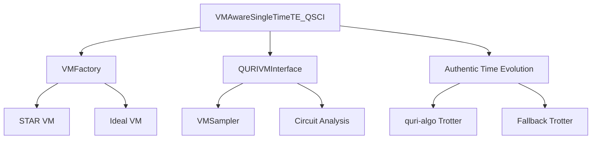

# VM-Aware QSCI Overview

The VM-Aware QSCI module extends the standard TE-QSCI algorithm with comprehensive quantum virtual machine (VM) analysis capabilities, enabling realistic quantum hardware resource estimation and authentic time evolution circuit generation.

## Key Features

### 🔬 **Authentic Time Evolution**
- Real Trotter decomposition using quri-algo instead of dummy circuits
- Automatic fallback to simplified Trotter when quri-algo unavailable
- Support for molecular Hamiltonian systems with realistic complexity

### 🖥️ **QURI VM Integration**
- Seamless integration with QURI VM for hardware simulation
- STAR architecture support for early fault-tolerant quantum computing
- Resource estimation at both LogicalCircuit and ArchLogicalCircuit levels

### 📊 **Comprehensive Analysis**
- VM overhead and fidelity impact calculation
- Circuit resource estimation (gates, depth, latency)
- Multi-error-rate comparison support
- Performance caching for efficiency

## Architecture Overview



## Core Components

### VMFactory
Factory for creating pre-configured QURI VM instances optimized for different quantum architectures:
- **Ideal VM**: Abstract quantum computation without noise
- **STAR VM**: Early fault-tolerant architecture with configurable error rates

### QURIVMInterface
Unified interface for QURI VM analysis and sampling:
- Circuit analysis at multiple levels
- Automatic VM instance management
- Error propagation and handling

### VMAwareSingleTimeTE_QSCI
Enhanced TE-QSCI algorithm with VM capabilities:
- Authentic time evolution using real Trotter decomposition
- VM metrics calculation (overhead, fidelity)
- Integration with molecular systems

## Getting Started

The VM-Aware QSCI module requires the following dependencies:
- `quri-parts` - Core quantum computing framework
- `quri-vm` - Quantum virtual machine simulation
- `quri-algo` - Advanced quantum algorithms (optional, for authentic time evolution)

```python
from src.qsci_vm_interface import create_vm_aware_te_qsci
from src.qsci_vm_analysis import VMFactory

# Create VM interface
vm_interface = create_star_vm_for_h6(error_rate=1e-3)

# Create VM-aware TE-QSCI algorithm
algorithm = create_vm_aware_te_qsci(
    hamiltonian=your_hamiltonian,
    evolution_time=1.0,
    vm_interface=vm_interface,
    use_vm_sampling=True
)

# Run analysis
result = algorithm.run()
```

## Use Cases

### Molecular System Analysis
Analyze quantum chemistry problems with realistic quantum hardware constraints:
- H2, H4, H6 linear hydrogen chains
- Resource scaling with molecular complexity
- Multi-error-rate impact assessment

### Quantum Algorithm Development
Develop and test quantum algorithms with authentic hardware simulation:
- Circuit optimization for specific architectures
- Resource estimation and planning
- Performance benchmarking

### Research and Education
Understand the impact of quantum hardware limitations:
- Compare ideal vs realistic quantum computation
- Study error propagation in quantum algorithms
- Explore fault-tolerant quantum computing architectures

## Next Steps

- [Getting Started Guide](getting_started.md) - Step-by-step setup and first examples
- [Authentic Time Evolution](authentic_time_evolution.md) - Deep dive into real Trotter decomposition
- [VM Analysis](vm_analysis.md) - Understanding VM metrics and resource estimation
- [Molecular Systems](molecular_systems.md) - Working with quantum chemistry problems
- [API Reference](../../api/vm_qsci.md) - Complete API documentation