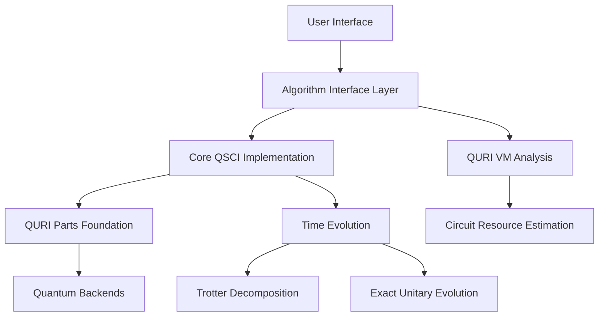

# Overview

## What is QSCI?

Quantum Selected Configuration Interaction (QSCI) is a quantum algorithm for quantum chemistry that systematically explores important electronic configurations to solve the electronic structure problem. This implementation extends the original QSCI with Time-Evolved variants (TE-QSCI) that use quantum time evolution to systematically generate configurations.

## Key Concepts

### Configuration Interaction
Configuration Interaction (CI) is a post-Hartree-Fock linear variational method for solving the nonrelativistic Schrödinger equation within the Born-Oppenheimer approximation. The key idea is to express the wavefunction as a linear combination of Slater determinants:

$$|\Psi\rangle = c_0|\Phi_0\rangle + \sum_{i}^{a} c_i^a|\Phi_i^a\rangle + \sum_{ij}^{ab} c_{ij}^{ab}|\Phi_{ij}^{ab}\rangle + \ldots$$

Where $|\Phi_0\rangle$ is the Hartree-Fock reference, $|\Phi_i^a\rangle$ are singly excited determinants, $|\Phi_{ij}^{ab}\rangle$ are doubly excited determinants, etc.

### Selected Configuration Interaction
The challenge with full CI is the exponential scaling with system size. Selected CI methods choose only the most important configurations based on some criterion. QSCI uses quantum sampling to identify these important configurations.

### Time Evolution for Configuration Generation
TE-QSCI uses quantum time evolution to systematically generate configurations:

$$|\psi(t)\rangle = e^{-i\hat{H}t}|\psi_I\rangle = |\psi_I\rangle - i\hat{H}t|\psi_I\rangle + \frac{(-i\hat{H}t)^2}{2!}|\psi_I\rangle + \ldots$$

The $k$-th order term in this expansion includes up to $2k$-th order excitations from the initial state, providing a systematic way to explore the configuration space.

## Algorithm Variants

### 1. VanillaQSCI
- **Purpose**: Standard QSCI algorithm
- **Approach**: Direct sampling from initial quantum states
- **Use Case**: Baseline QSCI implementation for comparison

### 2. SingleTimeTE_QSCI  
- **Purpose**: TE-QSCI at a single evolution time
- **Approach**: Time evolution at fixed time t
- **Use Case**: Exploring configurations at specific time points

### 3. TimeAverageTE_QSCI
- **Purpose**: TE-QSCI averaged over multiple times
- **Approach**: Average sampling over multiple evolution times
- **Use Case**: Improved sampling diversity and stability

### 4. StateVectorTE_QSCI
- **Purpose**: Exact state vector TE-QSCI
- **Approach**: Direct state vector calculation
- **Use Case**: Validation and small system studies

## Implementation Architecture

The QSCI implementation is built on the QURI ecosystem:

## Key Features

### QURI Ecosystem Integration
- **QURI Parts**: Quantum states, operators, and circuits
- **QURI Algo**: Algorithm interfaces and time evolution
- **QURI VM**: Circuit analysis and resource estimation

### Time Evolution Methods
- **Trotter Decomposition**: Approximate time evolution using product formulas
- **Exact Unitary**: Exact time evolution for small systems
- **Configurable**: Support for different Trotter orders and time steps

### Quantum Hardware Analysis
- **Circuit Analysis**: Gate counts, depths, and resource requirements
- **Architecture Support**: Analysis for different quantum architectures (e.g., STAR topology)
- **Performance Estimation**: Execution time and fidelity estimates

## Scientific Applications

QSCI has been validated on various quantum chemistry systems:

- **Small Molecules**: H$_2$, LiH with complete basis sets
- **Medium Molecules**: H$_6$ linear chain with STO-3G basis (919 Pauli terms)
- **Model Systems**: TFIM, Heisenberg models for algorithm validation
- **Random Systems**: Verification against exact diagonalization

## Performance Characteristics

### Computational Complexity
- **Configuration Selection**: O(N log N) where N is total configurations
- **Hamiltonian Matrix**: O(R²) where R is selected configurations  
- **Eigenvalue Problem**: O(R³) for dense matrices
- **Time Evolution**: O(T × G) where T is Trotter steps, G is gates

### Scaling Considerations
- **Memory**: Scales with number of selected configurations
- **Time**: Dominated by eigenvalue decomposition for large subspaces
- **Quantum Resources**: Circuit depth scales with evolution time and Trotter steps

## Validation and Testing

The implementation includes comprehensive validation:

- **Exact Diagonalization**: Comparison with scipy for small systems
- **Machine Precision**: Uniform superposition achieves < 1e-15 accuracy
- **Cross-Validation**: Multiple QSCI variants give consistent results
- **Molecular Validation**: Comparison with established quantum chemistry packages

## Next Steps

To get started with QSCI:

1. **[Installation](installation.md)**: Set up the environment
2. **[Quick Start](quickstart.md)**: Run your first calculation
3. **[Algorithm Guide](algorithms/overview.md)**: Choose the right variant
4. **[Examples](examples/basic_usage.md)**: Learn from practical examples